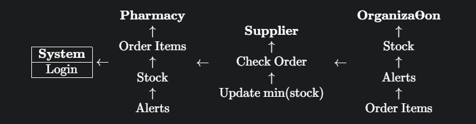

# MediPort

## Overview
MediPort is a web-based pharmacy inventory management system designed to address the inefficiencies of manual inventory tracking and purchasing in pharmacies. The platform empowers pharmacies to manage medicine stocks, orders, and supplier communications with a modern, user-friendly interface. By streamlining workflows, MediPort helps reduce stockouts, enhance data accuracy, and improve patient care delivery.


# The evolution of Idea
- https://www.indiatoday.in/india/story/no-medicine-shortage-patients-last-stage-maharashtra-nanded-government-hospital-deaths-2443689-2023-10-03
- https://www.indiaspend.com/more-indians-die-of-poor-quality-care-than-due-to-lack-of-access-to-healthcare-1-6-million-64432/
- https://www.biospectrumindia.com/news/17/14709/27-deaths-in-india-caused-by-poor-access-to-drugs-and-knowledge-medicus-.html

These where the main reasons which paved for the development of this project

# The concpet
- We are planning to create software—a web or web app solution—to monitor the stock of medicines in the pharmacy of a particular hospital.
- Medicines are typically supplied to a hospital by a particular manufacturer. A medical representative from a company visits the senior doctor at a hospital, introduces their medicine, and provides a sample for the doctor to test. The doctor tests the medicine, and if satisfied, may place further orders for the medicine from that manufacturer or company. If a medicine goes out of stock or the available quantity is very low, it is the responsibility of the pharmacy team to order more of that medicine manually.
- The main problem arises when hospitals do not order adequate amounts of medicine. To save money, they do not order every medicine, and if certain medicines (for example, for chickenpox or dengue fever) are not currently relevant, they will not order them until a case is reported in their hospital.
- Our software will track every medicine in each pharmacy of every hospital and enforce a mandatory threshold, or minimum required amount, for each medicine in a hospital. Whenever the stock goes below this minimum or is out of stock, an automatic request will be sent to the manufacturer, who can then send a confirmation order for the request. If any hospital does not accept the confirmation order or refuses to maintain the required amount in their inventory, strict action will be taken by the government. This minimum stock rule could even be made a criterion for maintaining hospital licenses. 

## Key Features
- **Real-time Inventory Tracking:** Pharmacists can monitor stock levels, expiry dates, and receive automated low-stock alerts.
- **Online Ordering:** Place orders for medicines directly through the platform, allowing seamless supplier communication and restocking.
- **Role-Based Access:** Interfaces for pharmacists, suppliers, and admin users, tailored to specific needs and tasks.
- **Automated Notifications:** The system generates alerts for inventory shortages and medication expiry, helping prevent shortages and wastage.
- **Comprehensive Reports:** Pharmacy managers have access to historical usage patterns and order histories to enable data-driven decisions.
- **SaaS Model:** No upfront investment in hardware or software—MediPort is accessible to pharmacies of all sizes.

## Modules
- **User Management:** Authentication and profile management for pharmacists.
- **Medicine Inventory Management:** Adding medicines, managing stock, and expiry alerts.
- **Order Management:** Placing and processing orders with suppliers.
- **Admin and Supplier Interfaces:** Administrative workflow and supplier order fulfillment.

## Architecture


## UML Diagram



## Technology Stack
- **Frontend:** HTML, CSS (for structure and styling)
- **Backend:** Node.js (server-side logic and scalability)
- **Templating Engine:** EJS (for dynamic HTML content)
- **Database:** MySQL (secure data storage and management)
- **Database Interface:** phpMyAdmin (GUI for database manipulation)
- **Development Tools:** Visual Studio Code, other IDEs

## Installation
1. **Clone the Repository**
   ```bash
   git clone https://github.com/Akash-vadakkeveetil/Mediport
   cd Mediport
   ```
2. **Install Dependencies**
   ```bash
   npm install
   ```
3. **Set Up the Database**
   - Install MySQL and phpMyAdmin
   - Create a database for MediPort and update the configuration file with the credentials
   - Import the schema from `db/schema.sql` (if provided)

4. **Run the Application**
   ```bash
   npm start
   ```
5. **Access MediPort**
   - Visit `http://localhost:PORT` in a web browser

## Usage
- **Pharmacist:** Log in to manage inventory, update medicine stock, and place orders.
- **Supplier:** Manage incoming orders and update order statuses.
- **Admin:** Oversee user management and system settings.

## Architecture & Design
- **Event-driven Node.js backend for scalability**
- **Separation of concerns using EJS templates**
- **Role-based access for different user types**
- **MySQL relational schema for secure record-keeping**
- **Robust reporting and alerting mechanisms**

## Security and Maintenance
- **Authentication:** Secure login for authorized personnel
- **Data Encryption and Firewall recommendations**
- **Ongoing updates and patches recommended for dependencies and server infrastructure**

## Roadmap & Future Plans
- **Mobile App Deployment:** Plans to deploy admin and user apps on Google Play Store and Apple App Store.
- **Free or Minimal Licensing:** MediPort aims to remain affordable and accessible to pharmacies with minimal upfront costs.
- **Continuous Feature Development:** Additional functionalities, improved reporting, and expanded inventory capabilities are planned.

## License
Check the repository for license details or contact the authors for more information.
